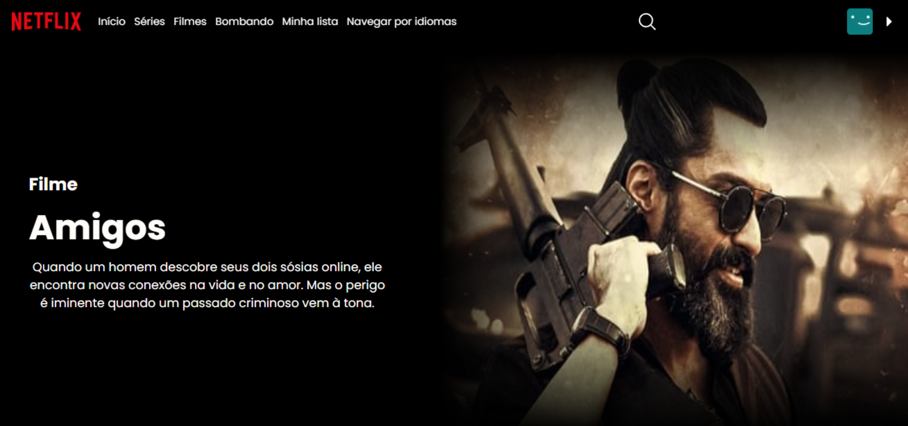

<h1 align="center"> Netflix </h1>

  <a href="#-tecnologias">Tecnologias</a>&nbsp;&nbsp;&nbsp;|&nbsp;&nbsp;&nbsp;
  <a href="#-projeto">Projeto</a>&nbsp;&nbsp;&nbsp;|&nbsp;&nbsp;&nbsp;

  

  

## 🚀 Tecnologias

Esse projeto foi desenvolvido com as seguintes tecnologias:

- HTML e CSS
- JavaScript
- Git e Github

## 💻 Projeto
Projeto unilizando algumas API, vai estar apresentando alguns filmes laçamentos, Populares, Bem avaliados, Séries bem avaliadas. com uma inteface identica ao site Original.

## API
- API_KEY = 'api_key=b4b5f9d98442f11bbdd50a5adf70f1d1';
- BASE_URL = 'https://api.themoviedb.org/3/';
- IMG_URL = 'https://image.tmdb.org/t/p/w500';
- language = 'language=pt-BR';

Feito com ♥ by Steffany Livino  
